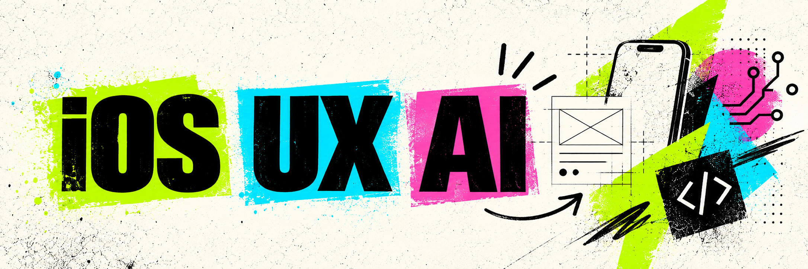

  

# iOS Developer

Native iOS development with **Swift, SwiftUI and UIKit** across Apple platforms.

**UX Engineering** complements this work by connecting user experience, interfaces, accessibility, information architecture and Design Systems to product development.

**Applied AI** adds another layer to this toolkit, especially through automation, AI agents and intelligent solutions integrated into products and workflows.

---

## Links

